# Deep Reinforcement Learning with Advantage Actor-Critic (A2C)

> A from-scratch PyTorch implementation of synchronous A2C trained and evaluated across classic control, box2d, and MuJoCo environments — with a head-to-head comparison against PPO.

---

## Demo

<p align="center">
  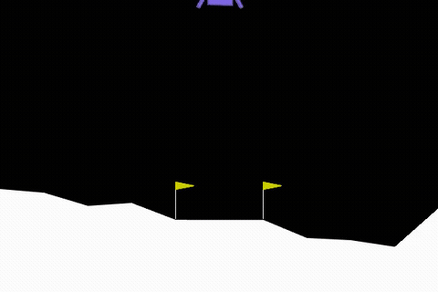
  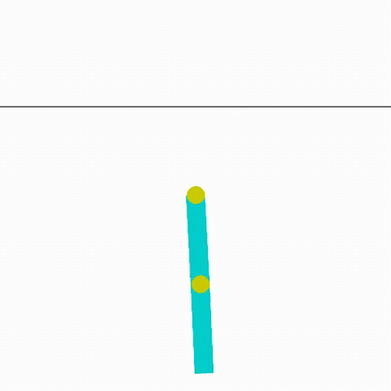
  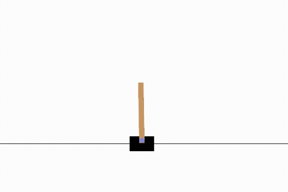
</p>
<p align="center">
  <em>LunarLander-v3 &nbsp;|&nbsp; Acrobot-v1 &nbsp;|&nbsp; CartPole-v1</em>
</p>

---

## Overview

This project implements and benchmarks **Advantage Actor-Critic (A2C)** — a synchronous, on-policy deep RL algorithm — across a diverse set of Gymnasium environments. The codebase is organised as a progressive build-up:

1. **Architecture foundations** — separate-network vs. shared-backbone actor-critic, loss functions, and advantage estimation from scratch.
2. **Parallel A2C on CartPole** — two synchronised worker threads collecting rollouts and updating a shared policy.
3. **Scaling to harder tasks** — LunarLander-v3, Acrobot-v1, and MuJoCo continuous-control (Hopper, HalfCheetah).
4. **A2C vs PPO benchmark** — side-by-side comparison of sample efficiency and final performance.

---

## Results

### 🚀 LunarLander-v3

The agent learns to fire thrusters precisely to land between the flags, achieving consistent soft landings.


| Metric | Value |
|---|---|
| Algorithm | A2C |
| Solved threshold | ≥ 200 reward |
| Evaluation episodes | 10 |

<p align="center">
  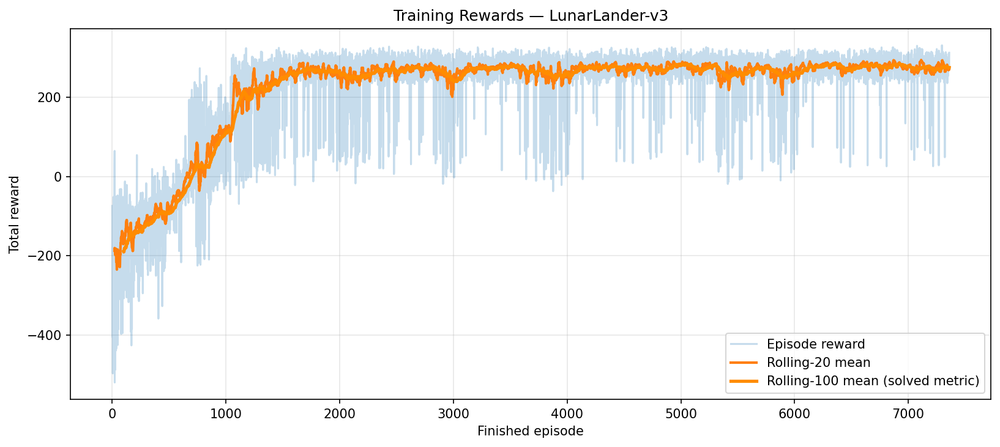
  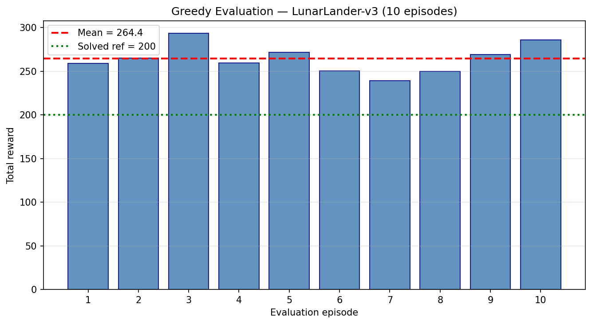
</p>

---

### 🤸 Acrobot-v1

The agent swings the double-pendulum arm up to reach the target height in as few steps as possible.


| Metric | Value |
|---|---|
| Algorithm | A2C |
| Goal | Reach target height in fewest steps |
| Evaluation episodes | 10 |

<p align="center">
  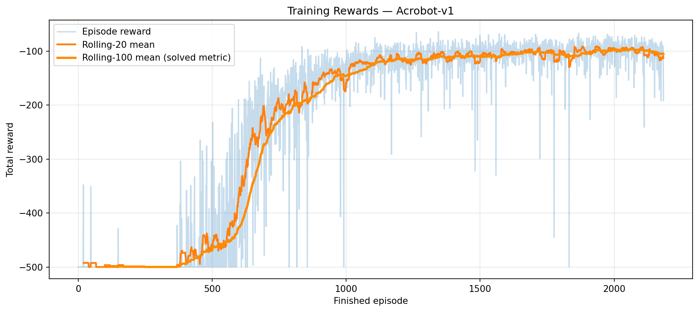
  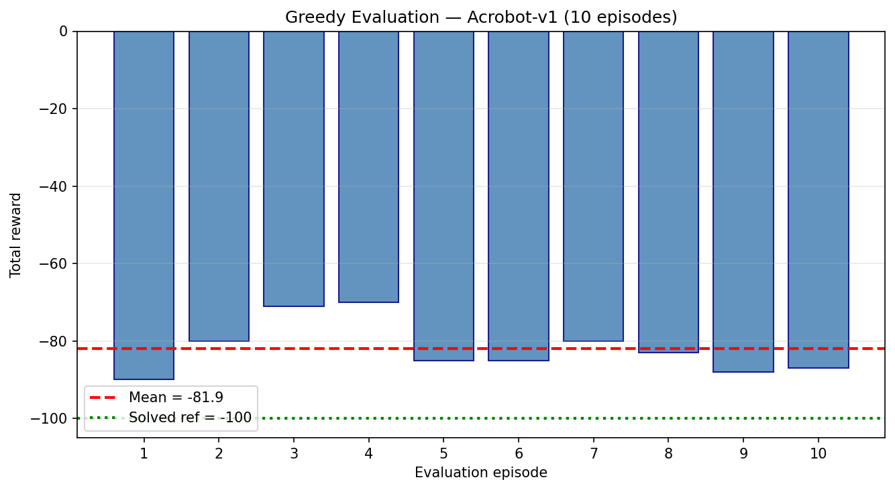
</p>

---

### 🎮 CartPole-v1

Two parallel workers collect n-step rollouts synchronously, updating a shared policy. Converges past the solved threshold reliably.


| Metric | Value |
|---|---|
| Algorithm | A2C (2 workers) |
| Solved threshold | ≥ 475 reward |
| Rollout length (n-step) | 20 |

<p align="center">
  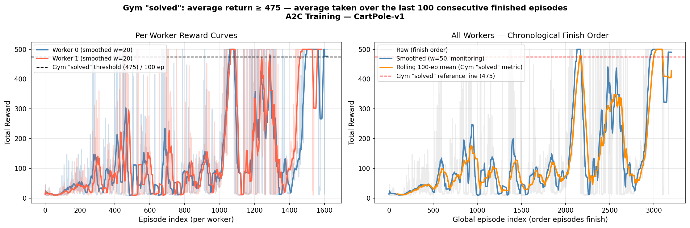
  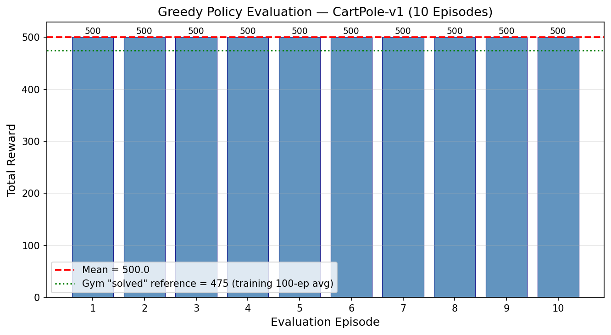
</p>

---

## A2C vs PPO

<p align="center">
  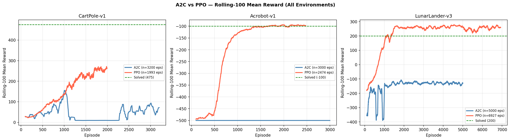
</p>


<p align="center">
  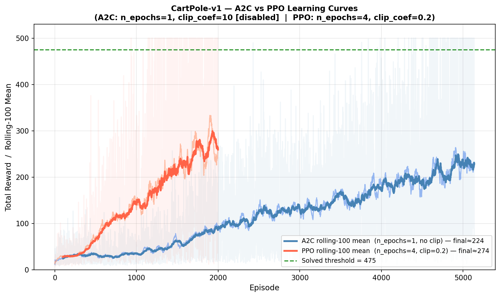
  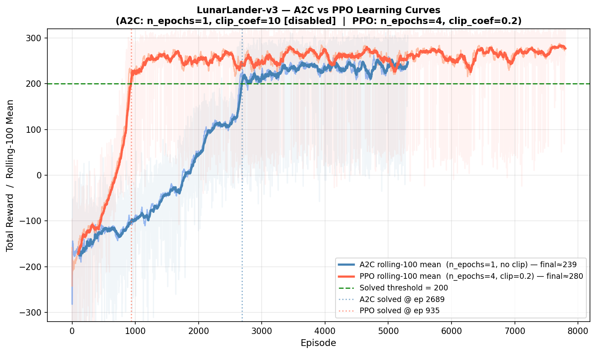
  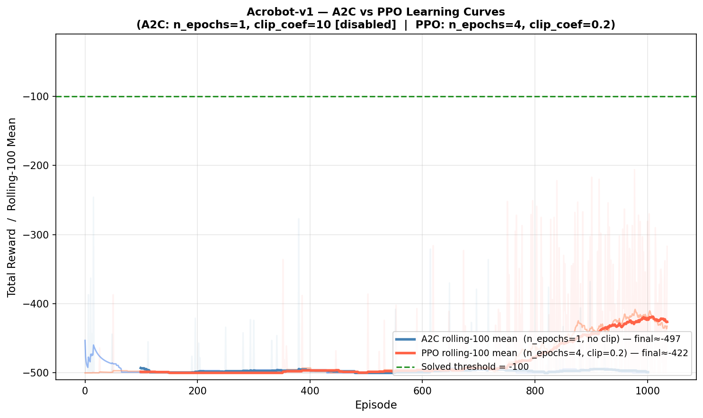
</p>

---

## How It Works

A2C decomposes the agent into two cooperating networks that share a common MLP backbone:

**Actor** `π(a|s; θ)` maps states to a probability distribution over actions. It is updated to increase the probability of actions with positive advantage:

```
L_actor = -E[ A(s,a) · log π(a|s) ] - β · H[π]
```

**Critic** `V(s; φ)` estimates expected return from state `s` and is updated to minimise TD error:

```
L_critic = E[ (R_t + γ·V(s_{t+1}) - V(s_t))² ]
```

**Advantage** `A(s,a) = R_t + γ·V(s_{t+1}) - V(s_t)` tells the actor whether each action was better or worse than expected — stabilising gradient updates compared to raw returns.

**Entropy bonus** `β · H[π]` encourages exploration and prevents premature convergence to a suboptimal deterministic policy.

The shared backbone uses **orthogonal weight initialisation** for stable early gradients, with separate output heads for the policy logits and scalar value estimate.

---

## Project Structure

```
.
├── A2C_algobase_cartpole_lunarlander.ipynb   # Actor-Critic architecture & loss building blocks
├── Advance_A2C_algo_Cartpole.ipynb           # Parallel A2C on CartPole-v1 (2 workers)
├── Lunarlander_Acrobot.ipynb                 # A2C on LunarLander-v3 & Acrobot-v1
├── PPO/
│   └── A2C_Hopper.ipynb                      # A2C on MuJoCo Hopper
├── cartpole_outputs/
│   ├── figures/                              # CartPole training & eval plots
│   └── videos/                              # CartPole rollout video
├── Results_for_LunarLander_Acrobot_A2C/
│   ├── figures/                              # LunarLander & Acrobot plots
│   └── videos/                              # LunarLander & Acrobot rollout videos
├── adv_ac_outputs/
│   └── figures/                              # A2C vs PPO comparison plots
├── mujoco_outputs/
│   └── figures/                              # MuJoCo HalfCheetah & Hopper plots
├── lunarlander.gif                           # Demo
├── acrobot.gif                               # Demo
└── cartpole.gif                              # Demo
```

---

## Getting Started

**Install dependencies:**

```bash
pip install gymnasium[box2d,mujoco] torch numpy matplotlib moviepy swig ale-py
```

**Requirements:** Python ≥ 3.9 · PyTorch ≥ 2.0 · Gymnasium ≥ 0.29

**Run a notebook:**

Open any of the `.ipynb` files in order — start with `A2C_algobase_cartpole_lunarlander.ipynb` for the foundations, then proceed through `Advance_A2C_algo_Cartpole.ipynb` and `Lunarlander_Acrobot.ipynb`.

---

*Built by Litheesh V R & Gandhar*
